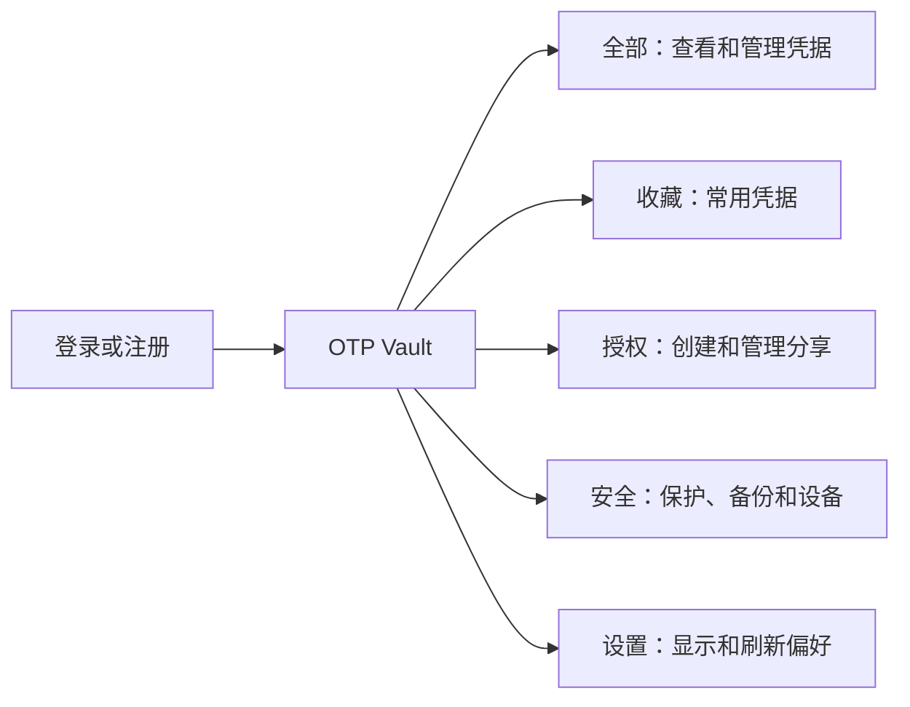
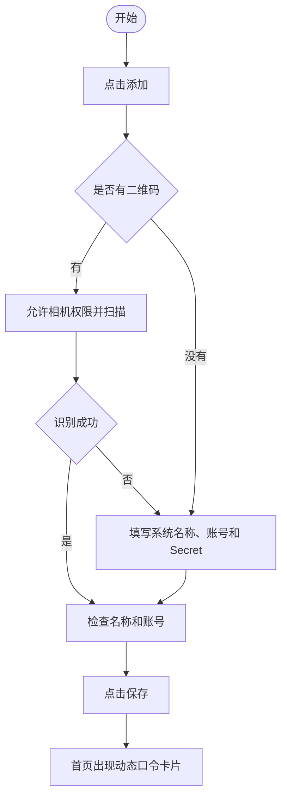
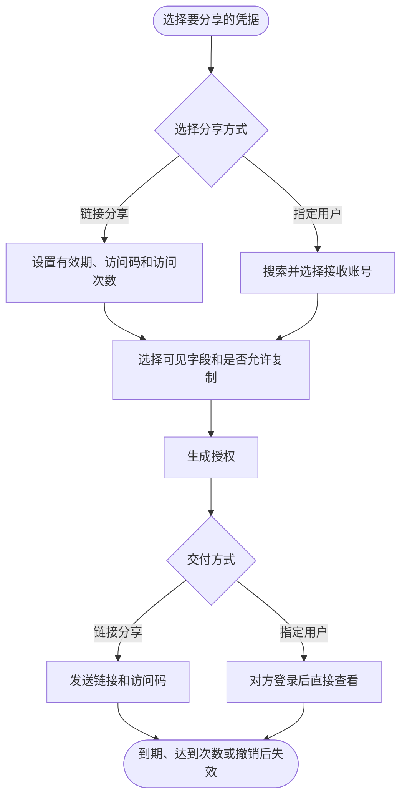

# OTP Vault 使用教程

OTP Vault 用于集中保存和查看动态验证码，并支持临时分享、敏感信息保护、加密备份和离线应急访问。

通常从 [https://otp.gooop.top](https://otp.gooop.top) 打开，也可以通过主站的 `/otp` 入口进入。建议使用手机浏览器，并确保系统时间已开启自动校准。

## 1. 页面导航

登录后，底部有五个主要入口：

在“全部”页面可以搜索系统或账号，也可以切换系统分组、紧凑模式、筛选和排序。

## 2. 登录和注册

已有账号时，可以选择以下任一方式登录：

- 邮箱和验证码
- 用户名和密码
- 已绑定的 Passkey

没有账号时，切换到“注册”，填写邮箱并输入验证码。注册成功后会自动登录，随后可以补充用户名和密码。

“保持登录 15 天”只建议在自己的设备上开启，不要在公共电脑或他人设备上使用。

## 3. 添加第一条动态口令

推荐直接扫描服务方提供的二维码；无法扫码时再手动录入。

### 扫码添加

1. 在“全部”页面点击“添加”。
2. 选择扫码，首次使用时允许浏览器访问相机。
3. 将二维码完整放入扫描区域，避免反光或画面模糊。
4. 检查识别出的系统名称和账号，确认后保存。

支持标准 OTP 二维码和 Google Authenticator 导出二维码；多张迁移二维码需要按页面提示依次扫描。

### 手动添加

至少填写以下内容：

| 项目 | 说明 |
| --- | --- |
| 系统名称 | 例如 GitHub、邮箱或公司系统 |
| 账号 | 用于区分同一系统下的多个账号 |
| OTP Secret | 服务方提供的 Base32 密钥，不要输入普通登录密码 |

多数服务使用默认的 `TOTP + SHA1 + 6 位 + 30 秒`，只有服务方明确给出不同参数时，才修改算法、位数或周期。HOTP 还需要填写计数器。

展开“更多信息”后，还可以保存登录密码、登录网址、备注，设置收藏和敏感等级。

### 导入文本

如果已有包含 `otpauth://` 地址的文本文件，可以点击“导入”，选择文件或粘贴内容后导入。导入前先确认文件来源可信。

## 4. 查看和使用动态口令

- 卡片会显示当前验证码和剩余时间，倒计时结束后自动刷新。
- 点击复制按钮可复制验证码；敏感信息是否允许复制取决于当前权限。
- 点击卡片可查看账号、登录密码、登录网址和备注等详情。
- 点击星标可加入“收藏”，常用账号会更容易找到。
- 系统较多时，可以开启“按系统分组”；信息密度较高时，可以开启“紧凑模式”。
- HOTP 不会按时间自动变化，需要点击“下一个”生成下一组验证码。

如果验证码一直不正确，先确认手机或电脑的日期、时间和时区均为自动设置，再核对录入的 Secret 和 OTP 参数。

## 5. 创建分享

可以从凭据卡片点击分享，也可以进入“授权”后点击“创建授权”。创建时可以填写授权名称，例如“王五的授权”；不填时默认为“临时凭据授权”。该名称会显示在授权列表、对方打开的授权页，以及复制分享信息的第一行。

### 第一步：选择凭据

勾选一条或多条自己的凭据。最高敏感等级的凭据只能分享给指定用户，不能生成公开链接。

### 第二步：选择分享方式

| 方式 | 适用场景 | 接收方是否需要登录 |
| --- | --- | --- |
| 链接分享 | 临时发给客户、同事或外部人员 | 不需要 |
| 指定用户 | 长期协作或敏感凭据 | 需要 |

链接分享可以设置：

- 有效天数：预设 1、3、7、30 天，也可自定义 1～365 天
- 访问码：可自动生成，也可自定义 4～12 位大写字母或数字
- 仅允许访问一次
- 最大访问次数：1～1000 次

建议通过不同渠道分别发送分享链接和访问码。

### 第三步：选择权限

按需勾选接收方可以看到的字段：账号、登录密码、动态口令、登录网址和备注。关闭“允许复制”后，对方只能查看，不能通过页面按钮复制。

### 第四步：生成并发送

确认设置后生成授权：

- 链接分享：复制完整分享信息，第一行是授权名称；允许自动填充时，其中的链接会通过 `#k=` 携带访问码，否则只复制普通授权链接。页面也提供单独复制授权链接或访问码的按钮。
- 指定用户：确认接收账号，对方登录后会在“全部”中看到获授权凭据。

分享创建后，可以在“授权”中查看状态和访问记录。有效授权可以继续编辑凭据、剩余有效期、可见字段、复制权限和访问次数，原链接、访问码、分享方式和接收人不会变化。撤销后链接立即失效，指定用户处的凭据也会移除。

## 6. 查看别人分享的内容

### 通过链接查看

1. 打开收到的分享链接。
2. 页面要求访问码时，输入发送方提供的访问码。
3. 查看允许展示的字段和动态口令。
4. 一次性、次数受限或已到期的链接可能无法再次打开。

分享页的倒计时会按服务器时间校准；可以使用顶部开关切换系统分组和紧凑显示。

### 通过指定用户接收

使用被授权的账号登录，在“全部”中查看共享凭据。共享内容会标明来源，不能编辑；授权到期或被撤销后会自动消失。

## 7. 安全设置

进入“安全” → “安全保护”可以管理以下功能：

### 敏感操作身份验证

该开关默认关闭。开启后，查看、编辑、分享或导出敏感信息前，系统会要求再次验证身份。

如果主要在自己的可信设备上使用，可以保持关闭；多人共用设备或安全要求较高时建议开启。

### Passkey

绑定 Passkey 后，可以使用设备指纹、面容或系统 PIN 登录，也可以用于敏感操作验证。可以在此处新增、重命名或移除 Passkey。

### 零知识保护

开启后，敏感字段会在浏览器中加密，保护密码只保留在本地使用，服务器保存的是密文。

零知识凭据不能创建由服务器生成的分享快照，因此适合不需要分享的个人凭据。忘记保护密码时，服务器无法替你恢复明文。

## 8. 备份、恢复和离线应急

进入“安全” → “备份恢复”。

### 创建加密备份

1. 设置至少 8 位的恢复密码。
2. 点击创建并下载 `.xbvault` 备份文件。
3. 将备份文件和恢复密码分开保管。

恢复密码不会上传到服务器。忘记密码后无法解密备份，因此建议存入可信的密码管理器。

### 恢复备份

1. 选择 `.xbvault` 文件。
2. 输入创建备份时使用的恢复密码。
3. 先校验并预览内容，再执行恢复。
4. 只有确实需要覆盖现有同名数据时，才选择替换冲突项。

### 离线应急副本

启用离线应急后，浏览器会保存一份加密的只读副本。网络不可用时，可以使用恢复密码打开并查看动态口令。

每次新增、修改或删除凭据后，应重新更新离线副本，否则离线看到的仍是旧数据。不要在公共设备上启用此功能。

## 9. 设备、回收站和安全活动

进入“安全” → “设备与记录”：

- 登录设备：查看浏览器、系统和来源 IP，可重命名、设为可信、撤销设备或退出其他设备。
- 回收站：误删的凭据可以恢复；永久删除后无法找回。删除凭据时，与它相关的分享会立即撤销。
- 最近安全活动：默认显示最近 20 条关键操作、设备和来源 IP，点击“加载更多”继续查看下一页。

发现陌生设备或异常来源 IP 时，应立即撤销该设备，并修改登录密码。

## 10. 常见问题

### 扫描不到二维码

确认已允许相机权限，擦净镜头并避免屏幕反光。仍无法识别时，使用服务方提供的 Secret 手动添加。

### 动态口令不正确

先开启设备的自动日期、自动时间和自动时区，再检查 Secret、算法、位数和周期是否与服务方一致。

### 分享链接打不开

联系发送方检查授权是否已到期、被撤销、达到访问次数上限，或访问码是否正确。

### 误删了凭据

进入“安全” → “设备与记录” → “回收站”恢复。已经永久删除的凭据无法恢复，只能从备份重新导入。

### 更换手机怎么办

推荐先在旧设备创建 `.xbvault` 加密备份，再在新设备登录后恢复。也可以生成迁移二维码，导入兼容的身份验证器应用。

## 安全建议

- 不要截图或明文发送 OTP Secret、登录密码和恢复密码。
- 分享时只开放对方真正需要的字段，并设置尽可能短的有效期。
- 定期检查登录设备和最近安全活动，及时撤销不再使用的授权。
- 删除服务方原有验证码配置前，先确认新设备上的动态口令可以正常使用。
